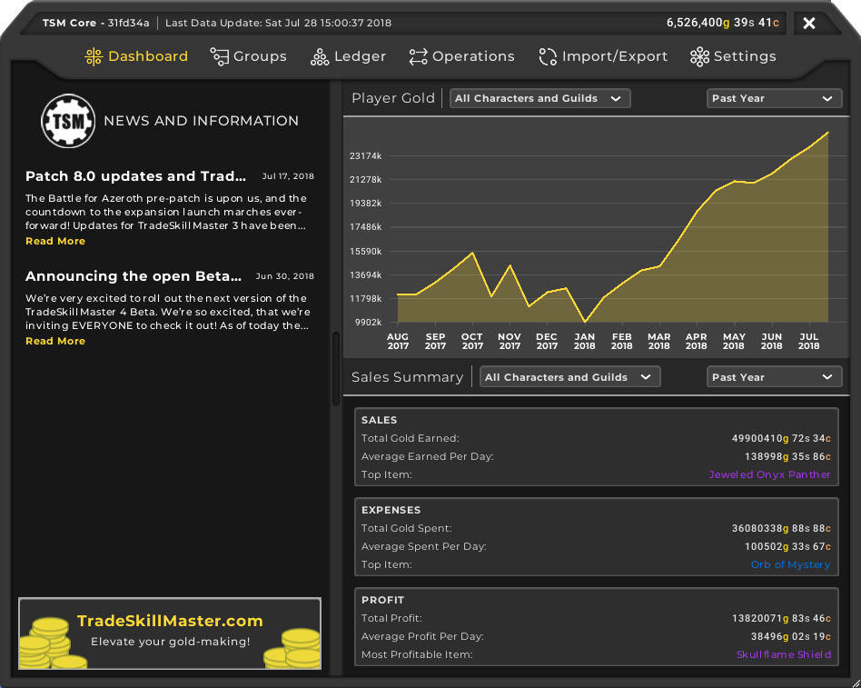

# TSM Groups  

## Getting Started

Open each text file with your favourite Text Editor and copy/paste the string in ***TSM Core*** under the Import Tab. Each group have their own operations defined by Custom Variables.

### Description

Here you will find my TSM Groups divided in two parts: _General_ and _Professions_, useful macros for most classes and my TSM setup with Custom Variables. I hope you find it useful. Enjoy  :smiley:

### Guides

[TSM Knowledge Base](http://support.tradeskillmaster.com/)

